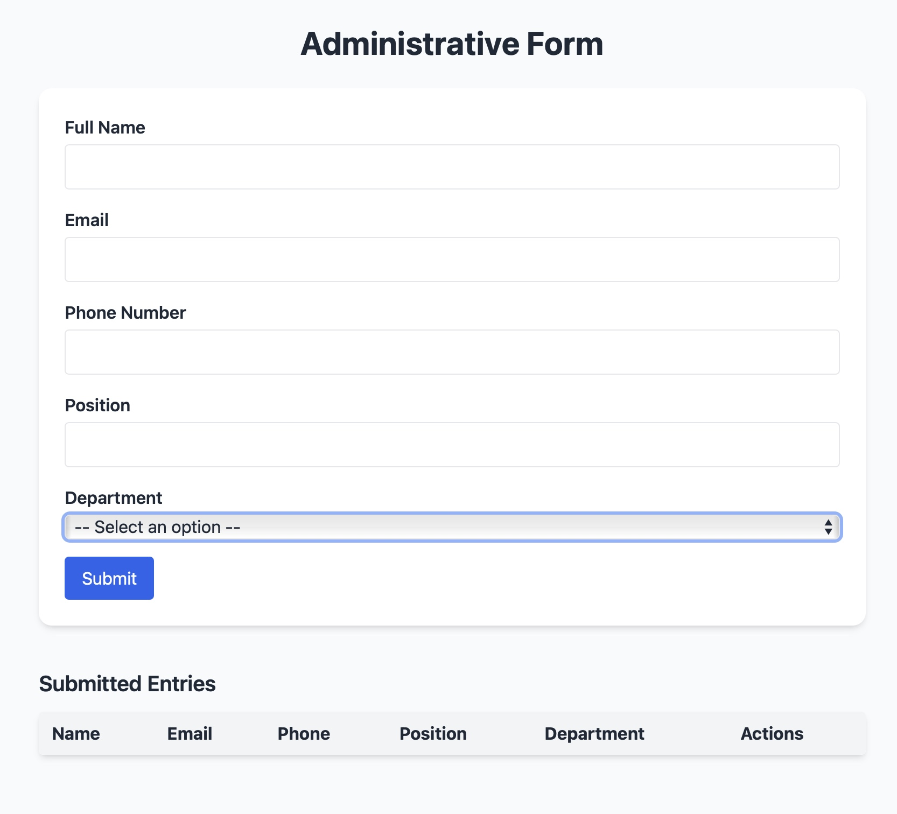

# 📝 Admin Form (Practice Project)

This is a simple and responsive administrative form built with **Vite**, **TailwindCSS**, and **Vanilla JavaScript**.

It allows users to fill in details like name, email, phone number, position, and department. Submitted entries are stored locally in the browser and displayed in a table with the option to delete them.

The main goal of this project was to practice building a user interface that handles form validation, local storage, and dynamic DOM updates — all styled with utility-first CSS using Tailwind.

---

## 🚀 Live Demo

👉 [https://an-im.github.io/admin-form/](https://an-im.github.io/admin-form/)

---

## 🛠️ Tech Stack

- **Vite** – for fast development build
- **Tailwind CSS** – for styling
- **JavaScript (Vanilla)** – for DOM manipulation and logic
- **Local Storage** – for saving entries in the browser

---

## 📁 Project Structure

```
admin-form/
├── src/
│   ├── main.js
│   ├── style.css
├── index.html
├── tailwind.config.js
├── postcss.config.js
├── package.json
└── preview.png
```

---

## 📸 Screenshot

You can see how the form looks in the image above   
The design is mobile-responsive and uses Tailwind utility classes for layout and styling.

---

## 🔄 Future Improvements

- Add form reset confirmation
- Add export to CSV option
- Improve accessibility with ARIA labels

---

## 🧑‍💻 Author

Built with ❤️ by [Antonella Imarisio](https://github.com/An-im)
